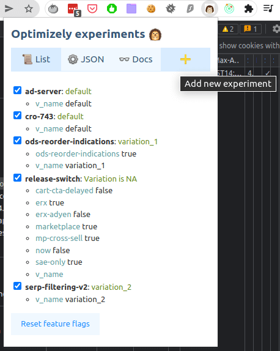

# Igel: SA Optimizely Tool

`Igel` is **Chrome** extension for the Optimizely experiments management.

## Features

How does it look?

The `List` tab lets you control experiments by turning them on or off, selecting a variation, and setting boolean variables for the release toggles.

The `JSON` tab is for editing raw feature flags JSON: it's preformatted, so it's still more convenient than the native Developer tools section.

The `Docs` tab contains some important notes about the current implementation and limitations.

## Install
1. Checkout repo to the local machine.
2. Using [this manual](https://developer.chrome.com/docs/extensions/mv3/getstarted/), install the project folder through the "Load unpacked" action.
3. Find the newly installed extension in the browser tray with extensions, pin it. 

Alternatively, you can install `.crx` extension file through the browser UI. For that, check the [releases page](https://github.com/RedTecLab/igel-chrome-sa-optimizely-tool/releases) (last availalbe version can be staled).

## Development
1. Install dependencies: `yarn`
2. [Add code completion for the `chrome` libs](https://newbedev.com/how-do-i-use-webstorm-for-chrome-extension-development).
3. Check [official documentation](https://developer.chrome.com/docs/extensions/mv3/devguide/)
