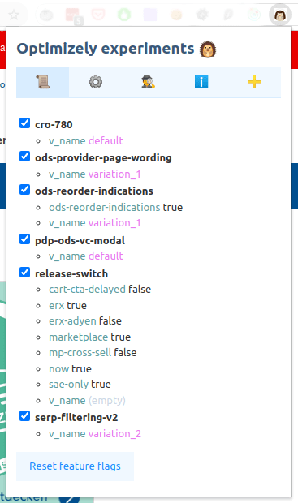

# Igel: SA Optimizely Tool

`Igel` is **Chrome** extension for the Optimizely experiments management.

## Features

How does it look?

- The `List` tab lets you control experiments by turning them on or off, selecting a variation, and setting boolean variables for the release toggles.

- The `JSON` tab is for editing raw feature flags JSON: it's preformatted, so it's still more convenient than the native Developer tools section.
  This tab is used when you need to manually modify some experiment's properties, or add/remove it completely.
  However, a new experiment can be added via the button, read further.

- The `Details` tab contains information about the current feature branch and targeting options, if available.

- The `Docs` tab contains some important notes about the current implementation and limitations.

- Tab ➕ allows you to add a new experiment.

## Installation

### Using git

1. Checkout repo to the local machine.
2. Using [these instructions], install the project folder through the "Load unpacked" action.
3. Find the newly installed extension in the browser tray with extensions, pin it.

### Chrome packed extension

How to install `.crx` extension file through the browser UI:

1. Check the [releases page] and download the latest available `.crx` file.
2. Install by clicking or dragging the file to the extensions page in the browser.
3. After installation, go to the 3rd point from the above.

This way may not work for you because of the strict Google Chrome security policies.

### Chrome unpacked extension

If you got a security error by Chrome:

1. Download the compressed `.zip` file from the [releases page].
   Use the latest available version with the version number in the title, not the source code.
2. Unzip it and enable with [these instructions].
3. After installation, go to the 3rd point from the above.

## Updates

Since the repository is private, it's not possible to automatically get the latest version,
so for now, the only way to check for updates is to open the repository page and check for the latest release.

## Development

1. Install dependencies: `yarn`
2. [Add code completion for the `chrome` libs](https://newbedev.com/how-do-i-use-webstorm-for-chrome-extension-development).
3. Check [official documentation](https://developer.chrome.com/docs/extensions/mv3/devguide/)
4. Run tests with `yarn test`
5. Run webpack watcher with `yarn watch`

**PRs and issue reports are welcome!**

## Release

1. Run `yarn bump:patch` or `yarn bump [minor|major] -t` for increasing the current version and adding a git tag.
2. If the commands hangs, hit `Ctrl+C` to interrupt the Commitizen master, waiting in the background.
It is fine for this case not to send a commit with a semantic message.
3. Commit updated files
4. Push with `git push --tags`
5. Prepare a [new release](https://github.com/RedTecLab/igel-chrome-sa-optimizely-tool/releases/new) in GitHub using the last tag
6. Usually, a release contains a built Chrome extension: it can be made locally according to the [docs](https://developer.chrome.com/docs/extensions/mv3/linux_hosting/#create)

[releases page]: https://github.com/RedTecLab/igel-chrome-sa-optimizely-tool/releases
[these instructions]: https://developer.chrome.com/docs/extensions/mv3/getstarted/
